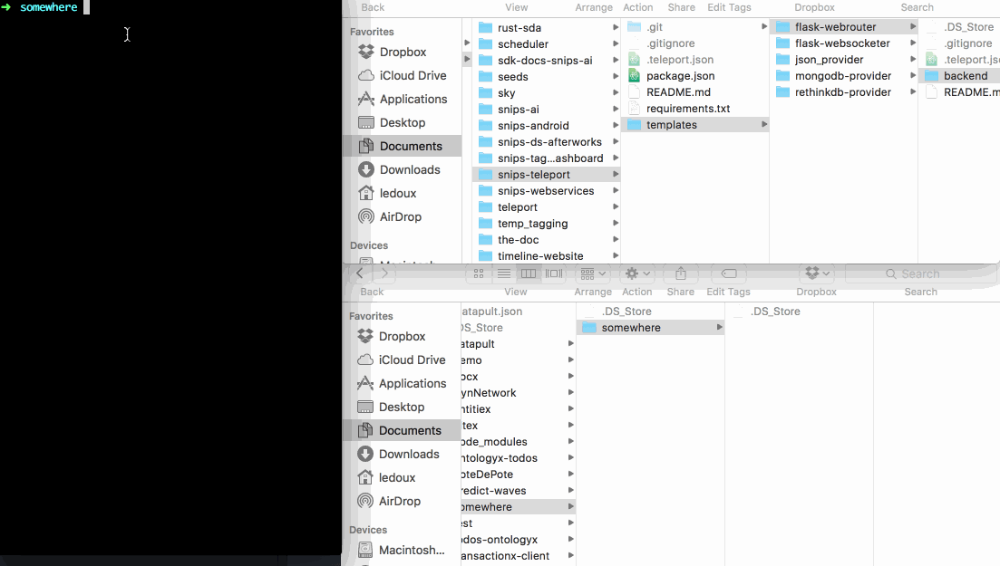
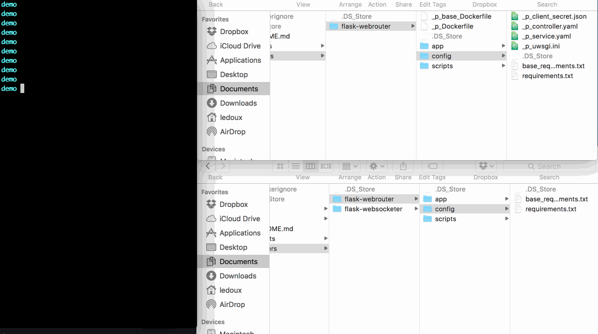
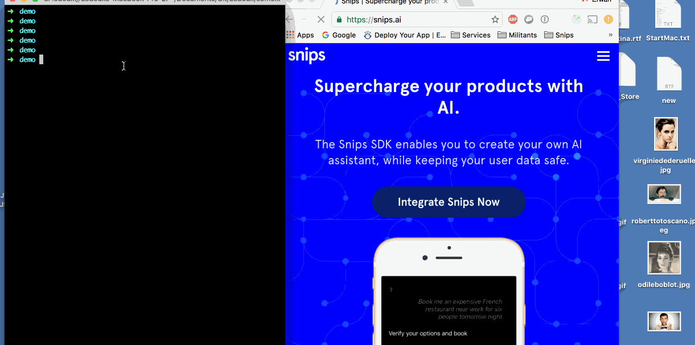

# teleport

<table>
  <td>
    
  </td>
  <td>
    A node framework to install and run quickly applications based on Node/Flask servers via kubectrl
  </td>
</table>

## Get started

1. make sure you have global dependencies

  - node v > 6
    ```
    git clone git://github.com/ry/node.git
    cd node
    ./configure
    make
    sudo make install
    ```

  - pip > 9
    ```
    curl https://bootstrap.pypa.io/get-pip.py -o "get-pip.py"
    python get-pip.py
    ```

  - yarn
    ```
    npm install -g yarn
    ```

  - virtualenv > 15.0.3 (use --upgrade if you already have an older version)
    ```
    sudo pip install virtualenv
    ```

  - kubectrl
    ```
    if [ '$(KERNEL)' = 'Darwin' ]; then \
  		curl -O http://storage.googleapis.com/kubernetes-release/release/v1.2.3/bin/darwin/amd64/kubectl; \
  	else \
  		curl -O http://storage.googleapis.com/kubernetes-release/release/v1.2.3/bin/linux/amd64/kubectl; \
  	fi
  	chmod +x kubectl
  	mv kubectl /usr/local/bin/
    ```

2. then install it globally
  ```
  npm set registry https://npm-registry.corp.snips.net
  npm install -g teleport.js
  ```
  or via git and install locally
  ```
  git clone git@github.com:Ledoux/teleport.git && cd teleport && yarn
  ```

3. you need to create and install your scope where are defined all of your backend and frontend configs so as your templates
  - create a new scope
    ```
    tpt -c --scope myTeleport
    ```
  - install the scope
    ```
    cd myTeleport && tpt -i
    ```
    ** NOTE ** : you might have an error install if you are ElCaptain OSX (10.11) with Xcode 8 (https://root.cern.ch/phpBB3/viewtopic.php?t=22376) for the uwsgi venv install.
    In that case for now, you may ... upgrade to Sierra (10.12), or find
    a https://developer.apple.com/download/more/


4. create a new project as a test
  ```
  tpt -c --project myApp --templates flask-webrouter
  ```

5. install the project
  ```
  cd myApp & tpt -i
  ```

5. Inside of the project you can run it localhost, first
  ```
  tpt -r
  ```

6. And you can deploy
  ```
  tpt -d
  ```

7. It should display
  ```
  Your service is available here : <your_dns_app>
  ```
  But make sure your your_dns_app is registered (ask @franblas if it is not the case)

Enjoy !

## Default Scope

We recommend you to play with the templates given in the default scope, like the default demo one (https://github.com/Ledoux/catapult/blob/master/examples/demo/README.md)

  - create step looks like :
  

  - install step looks like (but note that we chose the pip false option to not
    install the python libs in order to make shorter the gif video)
  

  - start step looks like :
  

  - deploy step looks like :
  
