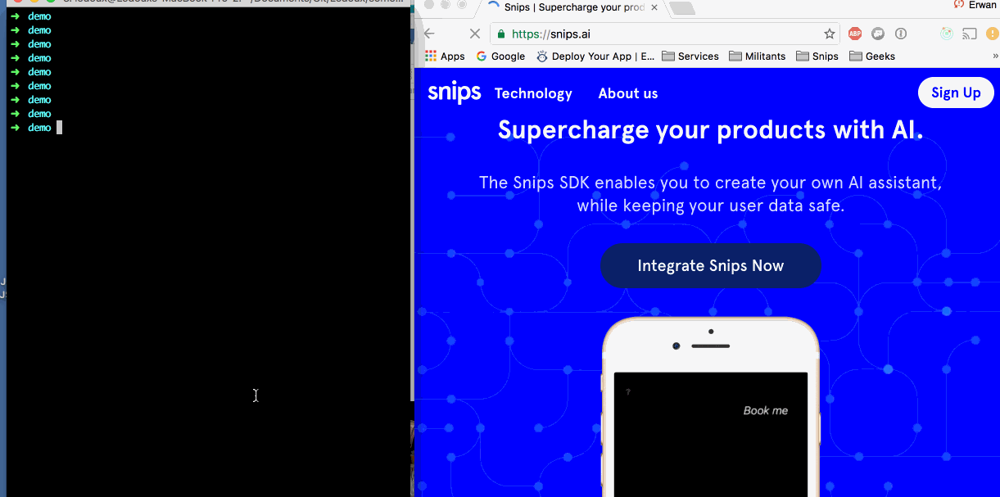

# teleport

<table>
  <td>
    
  </td>
  <td>
    A node framework to install and run quickly applications based on Node/Flask servers via kubectrl
  </td>
</table>

## Get started

1. make sure you have global dependencies

  - node v > 6
    ```
    git clone git://github.com/ry/node.git
    cd node
    ./configure
    make
    sudo make install
    ```

  - pip > 9
    ```
    curl https://bootstrap.pypa.io/get-pip.py -o "get-pip.py"
    python get-pip.py
    ```

  - yarn
    ```
    npm install -g yarn
    ```

  - virtualenv > 15.0.3 (use --upgrade if you already have an older version)
    ```
    sudo pip install virtualenv
    ```

  - kubectl
    ```
    if [ '$(KERNEL)' = 'Darwin' ]; then \
  		curl -O http://storage.googleapis.com/kubernetes-release/release/v1.2.3/bin/darwin/amd64/kubectl; \
  	else \
  		curl -O http://storage.googleapis.com/kubernetes-release/release/v1.2.3/bin/linux/amd64/kubectl; \
  	fi
  	chmod +x kubectl
  	mv kubectl /usr/local/bin/
    ```

2. then install it globally (WARNING: this is not yet a public package, so you need
  to register to our private npm-registry and be connected to our VPN):
  ```
  npm set registry https://npm-registry.corp.snips.net
  npm install -g teleport.js
  ```

3. Let's create a new project, based on our favorite templates here at Snips:
  ```
  tpt -c --project my-app --templates teleport-flask-webrouter,teleport-snips
  ```
  WARNING: please do not let space after the commas in the --templates option.
  (to know more about these templates, see https://github.com/snipsco/teleport-flask-webrouter and https://github.com/snipsco/teleport-snips)

5. install the project. First you need to activate a python venv:
  ```
  source <path_to_your_venv>/bin/activate
  ```
  Then install your app:
  ```
  cd my-app & tpt -i
  ```

5. If you want to run locally:
  ```
  tpt -s
  ```
  This opens a chrome window. You may refresh the page.
  Start step looks like :
  

6. And you can deploy:
  ```
  tpt -d
  ```
  WARNING: if you use the snips deploy config (via the teleport-snips template),
  you need also to do these things:
  a. make sure that you are connected to the Snips VPN
  b. make sure that you added your dns in the registry (but ask Erwan Ledoux or Francois Blas to do it)

7. It should display:
  ```
  Your service is available here : <your_dns_app>
  ```
  But make sure your your_dns_app is registered (ask @franblas if it is not the case)

Enjoy !
