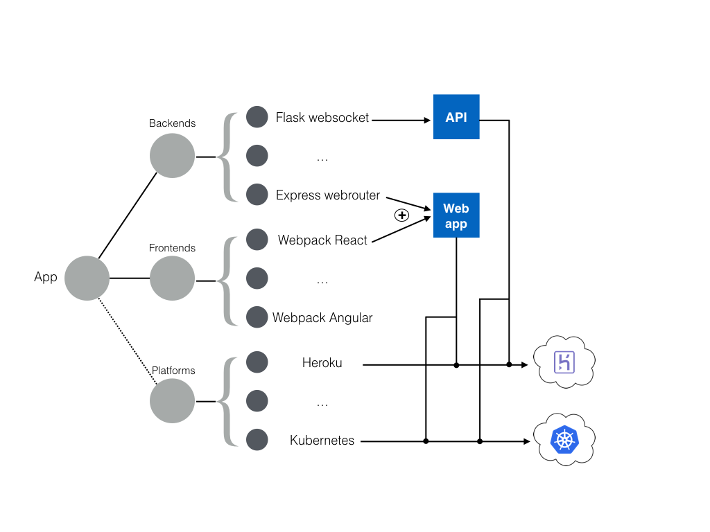

# Teleport
[](https://jenkins2.snips.ai/job/Snips Web/teleport/master)
[](https://badge.fury.io/js/teleport.js)

<table>
  <td>
    
  </td>
  <td>
    A node framework to quickly bootstrap and deploy applications based on templates
  </td>
</table>

## Overview


### Templates
- [Existing templates](docs/templates_list.md)

## Getting started
### Installation
Dependencies:
- Node version >= 6
- Python 2.7 + pip >= v8

You can install all dependencies and Teleport by typing
```
make install
```

## Setup backends
Teleport support for now 2 types of backend: Kubernetes and Heroku. We strongly recommend to start with Heroku in order to test the framework as Kubernetes needs a more complex infrastructure and specifics options to work.

### Heroku
To get started with heroku, just create an account (if not already done) on the platform: https://www.heroku.com/. Then install the command line tool https://devcenter.heroku.com/articles/heroku-cli.  

Setup your credentials
```
heroku login
```

That's it! You are all set! :smiley:

### Kubernetes
Not well supported yet... We are fixing this :construction:

[Additional setup](app_database.md) to the Kubernetes cluster.

## Start a new project
As an example let's create a web app on Heroku platform with the following components:
- A Python Flask server
- A Webpack React frontend on top of the server  

### Creation
We first create the app by typing
```
tpt -c --templates teleport-flask-webrouter,teleport-webpack-react,teleport-heroku
```
:warning: Please ensure that the options listed after the --templates flag are separated just by a single comma, as above - without any extra spaces - otherwise it will not work properly.

You can have more informations about those templates by checking their repos:
- [Flask webrouter](https://github.com/snipsco/teleport-flask-webrouter)
- [Webpack React](https://github.com/snipsco/teleport-webpack-react)
- [Heroku](platforms/heroku/)

### Run locally
If you want to test the app locally you can type
```
tpt -s
```

### Deploy the app
Let's now deploy it directly on Heroku as we choose this platform template.
```
tpt -d
```

After that your app should be now on heroku :smiley: Enjoy !

## Develop
If you want to develop the Teleport app, you need to go to your cloned
teleport repo and do first a new symlink for your tpt command:
```
npm run link
```
Then, you can develop the src files automatically compiled into the lib folder
thanks to the watch command:
```
npm run watch
```
